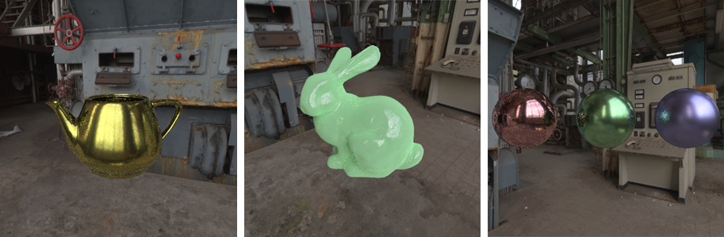
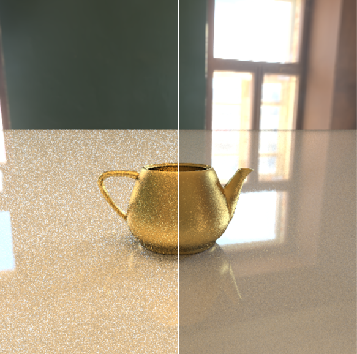

# StellaRT

Stella Raytracing Tutorial (StellaRT) is a lite code, simple tutorial for beginners to learn raytracing, with OpenGL and C++

<div align="center"></div>

# OverView

This tutorial contains 5 chapters, each chapter include tutorial blog (provide .md & .pdf files) and example code.

## part 1. basic ray tracing

In this part we will implement a basic ray tracing program with  C++, then output each pixel as the result to png image.

<div align="center"></div>

## part 2. BVH Accelerate Struct

We just using a for loop to travel meshes. But BVH will support us to tracing on a big mesh with lots of triangles, and accelerate the program.

<div align="center"></div>

## part 3. OpenGL ray tracing

Using OpenGL's fragment shader to run accelerate program. Transfer BVH and triangles in texture buffer, then send to shader. Finally tracing each pixel progressively, then display the dynamic tracing process in screen.

<div align="center"></div>

## part 4. disney principle's BRDF

Learning micro facet theory, using Disney principle's BRDF to rendering various of physical material.



## part 5. Importance Sampling & Low Discrepancy Sequence

Methods to denoise, accelerate fitting progress.

Low Discrepancy Sequence (Sobol) :

<div align="center"> </div>

Importance Sampling, diffuse (left) and BRDF (right) :

<div align="center"></div>

Importance Sampling for HDR envmap :

<div align="center"></div>

Multi Importance Sampling with Heuristic power :

<div align="center"></div>

# Requirement

environment:

* Windows 10 x64
* visual studio 2019
* vcpkg
* cmake

C++  lib:

  You can use `vcpkg install freeglut GLEW glm soil2` to add all these third_partys.

* GLUT (freeglut) >= 3.0.0
* GLEW >= 2.1.0
* GLM  >= 0.9.9.5

Third part cpp lib:

* hdrloader

# Build

cd to source coce directory, then:

```
cmake ./
```

# Other

* building on x64
* set project 'main' as 启动项目
* running in  **Release** mode

# Bugs & TODO

* fix error in chapter 1, it's right to multiply cosine **wo** in rendering equation, not **wi**
* 摆烂了

# Reference

[1] Brent Burley, Walt Disney Animation Studios 2012, [&#34;Physically-Based Shading at Disney&#34;](https://media.disneyanimation.com/uploads/production/publication_asset/48/asset/s2012_pbs_disney_brdf_notes_v3.pdf)

[2] Stephen Joe and Frances Kuo, [&#34;Sobol sequence generator&#34;](https://web.maths.unsw.edu.au/~fkuo/sobol/)

[3] Stephen Joe and Frances Y. Kuo, [&#34;Notes on generating Sobol sequences&#34;](https://web.maths.unsw.edu.au/~fkuo/sobol/joe-kuo-notes.pdf)

[4] cs184.eecs.berkeley.edu, [&#34;Project 3-2, Part 3: Environment Map Lights&#34;](https://cs184.eecs.berkeley.edu/sp18/article/25)

[5] blender (document), "[Cycles Sampling Patterns, Sobol](https://wiki.blender.org/wiki/Source/Render/Cycles/SamplingPatterns)"

[6] Shih-Chin, [&#34;Implementing Disney Principled BRDF in Arnold&#34;](http://shihchinw.github.io/2015/07/implementing-disney-principled-brdf-in-arnold.html)

[7] Matt Pharr, Wenzel Jakob, and Greg Humphreys, [&#34;Physically Based Rendering: From Theory To Implementation&#34;](https://www.pbr-book.org/3ed-2018/contents)

[8] knightcrawler25 (GitHub), [&#34;GLSL-PathTracer&#34;](https://github.com/knightcrawler25/GLSL-PathTracer)

[9] 文刀秋二 (知乎), [&#34;低差异序列（一）- 常见序列的定义及性质&#34;](https://zhuanlan.zhihu.com/p/20197323?columnSlug=graphics)

[10] ksg fk (知乎), [&#34;【Nori】任务5：路径追踪，微表面模型和多重重要性采样&#34;](https://zhuanlan.zhihu.com/p/397068211)

[11] Image Synthesis (CS474 F16), [&#34;Assignment 4 -- Image-based Lighting&#34;](https://sites.google.com/site/cmpsci474/assignment-4)

[12] Dezeming (CSDN), [&#34;多重重要性采样（MIS）与光线追踪技术&#34;](https://blog.csdn.net/tiao_god/article/details/109675133)

[13] lookof (博客园), [&#34;BVH with SAH (Bounding Volume Hierarchy with Surface Area Heuristic)&#34;](https://www.cnblogs.com/lookof/p/3546320.html)

[14] bluerose (知乎), [&#34;PBRT笔记(12)——蒙特卡洛积分&#34;](https://zhuanlan.zhihu.com/p/59679769)

[15] 孙小磊 (知乎), [&#34;计算机图形学十五：全局光照(蒙特卡洛路径追踪)&#34;](https://zhuanlan.zhihu.com/p/146714484)

[16] Atrix256 (twitter), [&#34;Casual Shadertoy Path Tracing&#34;](https://blog.demofox.org/2020/05/25/casual-shadertoy-path-tracing-1-basic-camera-diffuse-emissive/)
